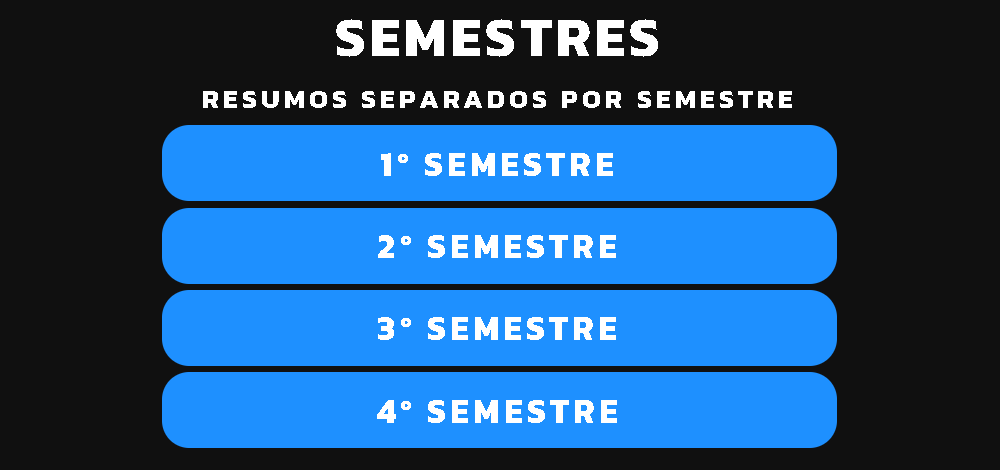
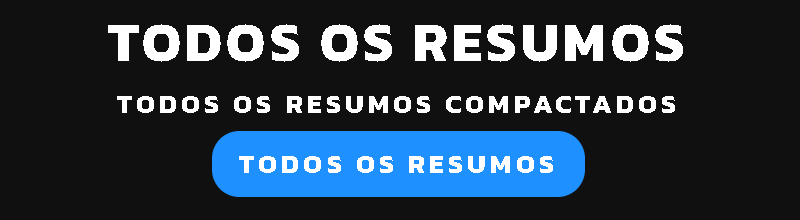
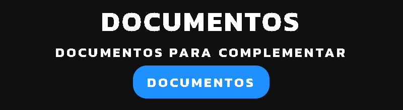

# Resumos

O **[Resumos ADS](https://plataformaresumos.netlify.app)** é uma plataforma desenvolvida durante meu período na faculdade. Ela oferece resumos gratuitos dos conteúdos abordados durante o curso, com o objetivo de colaborar com outros alunos. Todos os resumos foram elaborados por mim, o criador da plataforma e são exclusivos da mesma.

## Tecnologias

- **HTML:** Usado para estruturar a página da plataforma.
- **CSS:** Responsável por criar uma interface atraente e responsiva.
- **JavaScript:** Implementado para dar dinamismo à página e aplicar animações.

## Funções

### Semestres

1. Escolha o seu semestre e pressione o botão correspondente.
2. Os usuários podem ler ou baixar qualquer resumo do semestre selecionado.

 

### Todos os Resumos

1. Navegue até essa opção e pressione o botão correspondente.
2. Os usuários podem baixar um arquivo compactado contendo todos os resumos da plataforma, no formato `.PDF`.

 

### Documentos

1. Navegue até essa opção e pressione o botão correspondente.
2. Os usuários podem baixar um arquivo compactado contendo todos os resumos da plataforma, no formato `.DOCX`.

## Licença

**[MIT License](LICENSE.md)**